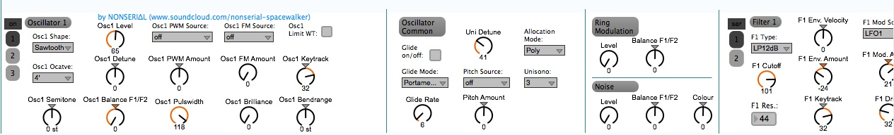

# NNSRL Blofed Editor

Repository of the old `NNSRL Blofeld Editor`, published in 2013. An new modular Bolfeld UI max4live plugin is available at [https://github.com/kapsner/blofeld-m4l-ui](https://github.com/kapsner/blofeld-m4l-ui).

## Description

The 'NNSRL Blofeld editor' is able to control nearly any parameter of the Waldorf Blofeld Synthesizer inside Ableton.

It uses MIDI-CC and Sysex to communicate with the hardware.

To get Sysex working, you have to run the file 'UDP_receive_runtime.maxpat' with MaxRuntime.

For further instructions, please read the README-file in the download folder.

If you like my editor, please follow me on facebook and soundcloud.
[https://facebook.com/NNSRL](https://facebook.com/NNSRL)
[https://soundcloud.com/nonserial-spacewalker](https://soundcloud.com/nonserial-spacewalker)

## GUI

[https://maxforlive.com/library/device/2061/nnrsl-blofeld-editor](https://maxforlive.com/library/device/2061/nnrsl-blofeld-editor)

## 2013 Instructions

You can use this Blofed-Editor in two ways:

- you can load the whole rack into a MIDI-track
- you can load only the modules that you actually need into a MIDI-track

This editor is a MIDI-effect. I recommend, to set up an Instrument-rack on a MIDI-track, and put the NNSRL Blofeld Editor in front of it.

This editor uses two different protocols, to change parameters of the Waldorf Blofeld synthesizer:

- all parameters, that are listed in the Blofeld Manual on page 113 ff. (http://www.waldorf-music.info/de/downloads-blofeld/534-documentation.html), are being changed via MIDI-CC
- the other parameters, that can be found in this list (http://www.waldorf-music.info/en/downloads-blofeld/tools/424-blofeldsysexv104.html), communicate via Sysex with the Blofeld

Unfortunately, there are some limitations in Abelton Live 9 when using Sysex. It seems, that Ableton filters the Sysex-messages on its way out, so they cannot be sent to the Blofeld. MIDI-CC works fine inside Abelton.

Anyways, I did some research on the internet, and I found a way, to get Sysex working inside Ableton Live:  
To be able to control all parameters on the Blofeld, you need to run the file “UDP_recieve_runtime.patch” in the Application “MaxRuntime” (http://cycling74.com/downloads/runtime/).

All parameters, which need the Sysex-protocol will now send its messages from Ableton to MaxRuntime, and from there to the Waldorf Blofeld and thus bypassing Abletons Sysex-filter.

How to set everything up, you can watch in my tutorial on youtube:
https://www.youtube.com/watch?v=lteFYkizgTw

If you like to support me, please buy my EP “Highly Contagious” that was released on 13th of December 2013 on CongaRecords.

Special credits to Josh Feldman, who gave me some help on understanding the code for Sysex-messages in Max4Live. Have also a look at his M4L-Blofeld-Editor (http://wblofeldeditor.tumblr.com/), that comes as a standalone.

Download-URL: [http://www.mediafire.com/download/9llxvw10fl9co2o/NNSRL+Blofeld+Editorv0.23.zip](http://www.mediafire.com/download/9llxvw10fl9co2o/NNSRL+Blofeld+Editorv0.23.zip)

## Disclaimer

This product is in no way affiliated with or endorsed by [Waldorf Music](https://waldorfmusic.com).

## License

NNRSL Blofeld Editor © 2013 by NONSERIAL/Lorenz Kapsner is licensed under [Creative Commons Attribution-NonCommercial-ShareAlike 4.0 International](https://creativecommons.org/licenses/by-nc-sa/4.0/?ref=chooser-v1)
